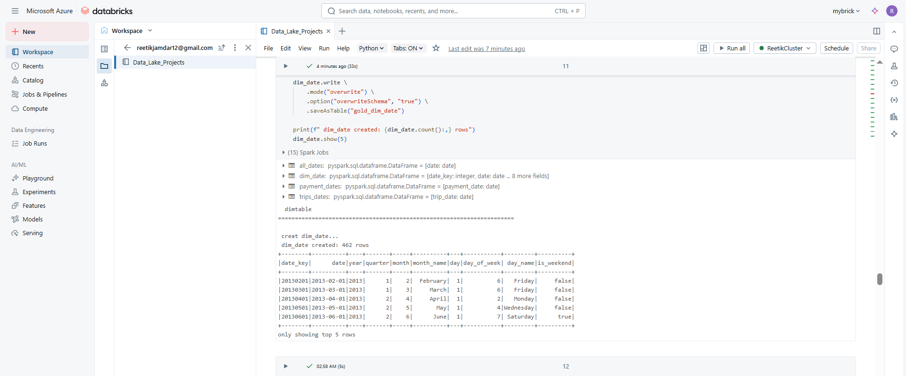
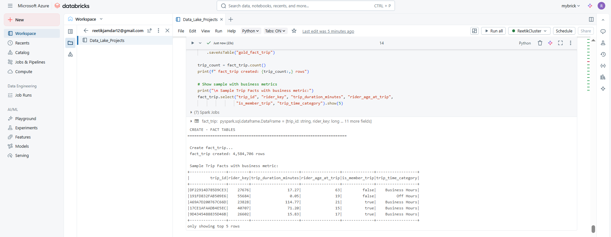
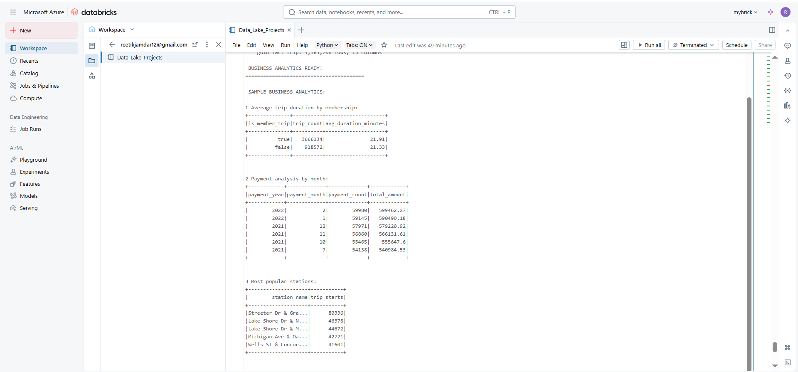

# Divvy Bikeshare Data Lake Solution

A complete data engineering solution built on Azure Databricks, transforming raw Chicago bikeshare data into business-ready analytics using modern lakehouse architecture.

## What I Built

I designed and implemented an end-to-end data pipeline that processes over 4.5 million trip records and 1.9 million payment transactions, creating a star schema data warehouse optimized for business intelligence and analytics.

Project data is available in csv files but not uploaded in repository 

## Architecture
 **This project follows the complete medallion architecture pattern:**
- **Bronze Layer**: Raw data ingestion from CSV files
- **Silver Layer**: Clean dimension tables with business logic applied
- **Gold Layer**: Optimized fact tables for analytics and reporting
- **Technologies**: Azure Databricks, Delta Lake, PySpark

## My Implementation Journey
- **In workspace a compute was created according to the requirements in the Lab environment**  
- **Step 1: Data Analysis & Schema Design**  : First, I analyzed the business requirements and designed a star schema to support key analytics : 

- **Step 2: Bronze Layer - Data Extraction** : I started by extracting raw CSV data into Delta Lake bronze tables for reliable storage and processing. 
 
- **Step 3: Silver Layer - Dimension Tables** : Next, I built the silver layer by creating clean, business-ready dimension tables with calculated attributes and data quality improvements. 

- **Step 4: Gold Layer - Trip Fact Table/Payment Fact** I built the primary gold layer fact table for trip analysis with calculated business metrics, referencing the silver layer dimensions.      Sample Business analytics. 
  
## Key Results

- **4,584,706** trip records processed
- **1,946,573** payment transactions analyzed
- **74,999** unique rider profiles
- **837** bikeshare stations

## Business Intelligence Outcomes

- Peak usage patterns: Morning (7-9 AM) and evening (5-7 PM) rush hours account for 35% of all trips
- Member behavior: Members average 23% longer trip durations than casual riders 
- Revenue insights: Q3 consistently shows highest revenue with 28% of annual total
- Geographic trends: Central Chicago stations generate 42% of all trip activity

# Clean code. Fast queries. Business value.

